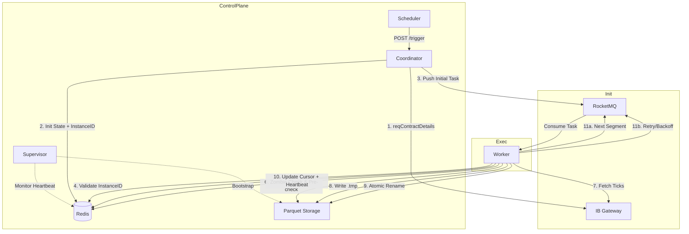

# **Aetherium Trader - Distributed Ingestion Platform (IDD)**

| 屬性 | 內容 |
| --- | --- |
| **版本** | **2.4 (Zombie Protection & Multi-Window RL)** |
| **日期** | 2025-11-18 |
| **模組** | Ingestion Service |
| **狀態** | **Ready for Implementation** |

## **1. 核心設計理念**

本系統旨在建立一個高抗性、支援斷點續傳且具備嚴格合規性（IB Pacing）的分散式資料擷取平台。v2.4 版本重點在於解決分散式環境下的 **Zombie Worker (殭屍行程)** 問題、強化 **Redis 故障復原** 能力，並引入 **多重時間視窗限流**

1. **狀態外包與實例綁定 (Externalized State with Instance Binding)**
    - Worker 不持有狀態，所有進度存於 Redis
    - 每個 Job 的每次執行週期都有唯一 ID，防止舊的 Worker (Zombie) 覆蓋新 Worker 的數據
2. **任務匯流排 (Task Bus)**
    - 使用 **Apache RocketMQ 5.x**
    - 利用 **Timer Message** 實現精確的指數退避 (Exponential Backoff) 與 Jitter 重試機制
3. **遞迴式擷取 (Chained Execution)**
    - 微任務架構：每個任務只抓取一小段 (Segment)，完成後自動產生下一段任務
    - **Cursor 高水位定義：** Cursor 嚴格代表「連續完整區間的高水位 (High Water Mark)」，Backfill (補洞) 任務不推進 Cursor
4. **多維度分散式限流 (Multi-Window Rate Limiting)**
    - 放棄單一 Token Bucket，改用 **Redis Lua Script** 實作多重滑動視窗 (10m, 1m, 1s)
    - 支援多帳號維度 (`account_id`) 隔離
5. **原子化提交與防腐 (Atomic Commit & Anti-Corruption)**
    - 寫入流程：`.tmp` 寫入 → `fsync`  → 原子 `rename`
    - 檔名包含 `job_instance_id`，FS Recovery 時僅信任與當前 Job State ID 一致的檔案
6. **心跳監測 (Heartbeat Monitoring)**
    - 取代單純的佇列長度監控。Worker 執行時定期更新 Redis `heartbeat_at`，Supervisor 依此判定 Job 是否停滯 (Stalled)

## **2. 系統架構**

### **2.1. 元件角色**

- **Coordinator Service (Web API)**
    - 負責接收 Trigger 請求
    - 生成唯一的 `job_instance_id` (UUID)
    - 呼叫 IB `reqContractDetails` 獲取 RTH (Regular Trading Hours)
    - 初始化 Redis State
- **Redis (State & Rate Limit)**
    - **State DB:** 儲存 Job 狀態、Cursor、Heartbeat、Critical Ranges
    - **Rate Limit DB:** 儲存多維度 ZSET (Sorted Set)
    - 必須開啟 **AOF (Append Only File)** 以確保持久化
- **Supervisor (Monitoring & Recovery)**
    - 週期性掃描 Redis
    - **Stalled Detection:** 檢查 `now - heartbeat_at > threshold`
    - **Bootstrap:** 若 Redis 資料遺失，負責掃描 FS 重建 Job State
- **Ingestion Worker (Rust)**
    - 無狀態消費者
    - 執行 Lua 限流腳本
    - 執行「寫入暫存 → 原子 Rename」流程
    - **Zombie Check:** 任何寫入或更新前，必先比對 `job_instance_id`

### **2.2. 運作流程 (Mermaid)**



## **3. 詳細設計**

### **3.1. Redis 資料結構**

### **A. 任務狀態表 (Job State)**

**Key:** `ingest:job:{symbol}:{date}`

**Type:** Hash

| Field | 範例值 | 說明 |
| --- | --- | --- |
| `status` | `RUNNING` | 任務狀態 (PENDING/RUNNING/COMPLETED/FAILED) |
| `job_instance_id` | `a1b2-c3d4-uuid` | **[重要]** 當前執行的唯一實例 ID |
| `cursor` | `1731853800000` | 連續完整區間的高水位 (Unix ms) |
| `end_time` | `1731880800000` | 當日收盤時間 |
| `heartbeat_at` | `1731853850000` | 最後一次 Worker 回報時間 |
| `critical_ranges` | `[[9:30, 16:00]]` | RTH 關鍵時段 (JSON) |
| `last_error_type` | `IB_504` | 最近一次錯誤類型 |

### **B. 多維度限流 (Multi-Window Rate Limit)**

**Key:** `rate_limit:{source}:historical:{account_id}:{window}`

**Type:** ZSET (Sorted Set)

**TTL:** 對應 Window 長度 + Buffer

- **Keys 範例:**
    1. `rate_limit:ib:historical:U12345:10m` (限制長期平均)
    2. `rate_limit:ib:historical:U12345:1m` (平抑短期爆量)
    3. `rate_limit:ib:historical:U12345:1s` (避免瞬時尖峰)
- **Score:** Request Timestamp (ms)
- **Member:** `{req_id}:{worker_id}` (需唯一)

### **3.2. RocketMQ 規格**

**Topic:** `ingest.tasks`

**Payload (JSON):**

```json
{
  "job_key": "ingest:job:NQ:2025-11-18",
  "symbol": "NQ",
  "date": "2025-11-18",
  "job_instance_id": "a1b2-c3d4-uuid",
  "start_ts": 1731853800000,
  "retry_count": 0,
  "backfill": false
}
```

### **3.3. API 介面 (Coordinator)**

- **Trigger Endpoint:** `POST /api/v1/ingest/trigger`
- **Logic Update:**
    1. 生成 `new_instance_id = UUID()`
    2. 呼叫 IB 取得 `critical_ranges`
    3. `HSET` 初始化 Redis，寫入 `job_instance_id` 與 `heartbeat_at = now`
    4. 發送初始任務至 MQ，Payload 攜帶此 `new_instance_id`

### **3.4. Worker 核心邏輯**

Worker 收到任務後，執行以下嚴格步驟：

### **1. Context Validation (環境驗證)**

- 解析 Payload 中的 `msg_instance_id`
- 讀取 Redis `ingest:job:{symbol}:{date}`
- **Zombie Check**
    - 若 Redis 中的 `job_instance_id` != `msg_instance_id`
        - **Action:** 判定為過期任務 (Zombie)，直接 ACK 丟棄，不執行任何寫入
- **Heartbeat:** 更新 Redis `heartbeat_at = now`

### **2. Rate Limit Check (Lua Script)**

- 呼叫 Lua Script，傳入 3 個 Window Keys (10m, 1m, 1s)
- **Lua Logic**
    - 使用 Redis Server Time (`TIME` 指令) 作為 Clock Source
    - 對每個 Window 執行 `ZREMRANGEBYSCORE` 清理舊資料
    - 檢查 `ZCARD` 是否超過 Limit
    - 若全通過 -> `ZADD` -> 回傳 `allowed=1`
    - 若任一失敗 -> 回傳 `allowed=0`
- **Result Handling**
    - 若 `allowed=0`：計算 **Exponential Backoff + Jitter**，發送 Timer Message 重試，ACK 當前訊息

### **3. Idempotency & FS Check (冪等性檢查)**

- 定義檔名
    - `final_path`: `/data/.../part_{start_ts}_{msg_instance_id}.parquet`
- **檢查檔案是否存在**
    - 不存在：繼續執行 Step 4 (Fetch)
    - 已存在 (Same Instance ID)：代表之前的 Worker 寫入成功但 Crash
        - 驗證檔案完整性 (Sanity Check: `row_count > 0`)
        - 若完整 -> 跳至 Step 6 (Update Cursor)
    - 已存在 (Different Instance ID)
        - 視為舊實例遺留的檔案
        - 策略：覆蓋它 (因為我們是新的權威實例)，繼續執行 Step 4

### **4. Fetch & Write (執行擷取)**

- 呼叫 IB API (`reqHistoricalTicks`)
- 若有資料 (Ticks > 0)
    1. 寫入暫存檔 `.tmp`
    2. `fsync`
    3. Atomic Rename 至 `final_path`

### **5. Update Cursor (更新狀態)**

- 再次檢查 Redis `job_instance_id` (Double Check 防止 Race Condition)
- 若 `backfill == false` (主線任務)
    - `HSET` 更新 `cursor = last_tick_ts`
    - `HSET` 更新 `heartbeat_at = now`

### **6. Chain Execution (遞迴)**

- 若 `last_tick_ts < end_time`
    - 計算 `next_start = last_tick_ts + 1ms`
    - 發送 Next Task 至 MQ (攜帶相同的 `job_instance_id`)
- ACK 當前訊息

## **4. 容錯與復原 (Resilience)**

### **4.1. Zombie Worker 防護 (The ABA Problem)**

- 情境：Worker A 卡住 (GC 或網路)，Redis 判定 Stalled 並啟動新實例 (Worker B, Instance ID 2)。Worker A 甦醒並嘗試寫入
- 解法：Worker A 的 Payload 攜帶 Instance ID 1。它在寫入 Redis 或 FS 前，會發現 Redis 當前的 ID 為 2
- 結果：Worker A 自動自殺 (ACK 並退出)，保護數據一致性

### **4.2. Redis 資料遺失復原 (Bootstrap)**

- 情境：Redis 節點崩潰且 AOF 損毀，Job State 全部遺失
- 解法 (Supervisor)
    1. 掃描 `/ticks/{symbol}/{date}/` 目錄
    2. 解析檔名 `part_{ts}_{instance_id}.parquet`
    3. 找出最新的 `ts` 作為 `cursor`
    4. 使用檔名中的 `instance_id` 重建 Redis State
    5. 若發現時間軸有中間缺漏，自動發送 `backfill=true` 的補洞任務

### **4.3. Stalled Job 處理**

- 偵測：Supervisor 發現 `status=RUNNING` 且 `now - heartbeat_at > 10 min`
- 處置
    1. 標記舊 Job 為 `FAILED` (或 `STALLED`)
    2. (可選) 觸發新的 Trigger，生成新的 `job_instance_id` 接手後續任務

## **5. 部署建議**

| 元件 | 建議配置 | 備註 |
| --- | --- | --- |
| **Redis** | **AOF Enabled** (`appendonly yes`) | 必須確保資料不遺失 |
| **RocketMQ** | **5.x Cluster** | 需支援 Timer Message |
| **Worker** | 1-2 Pods per Account | 瓶頸在 IB 限流，多開無益 |
| **Rate Limit** | **Lua Script** | 部署至 Redis，Worker 僅呼叫 SHA |